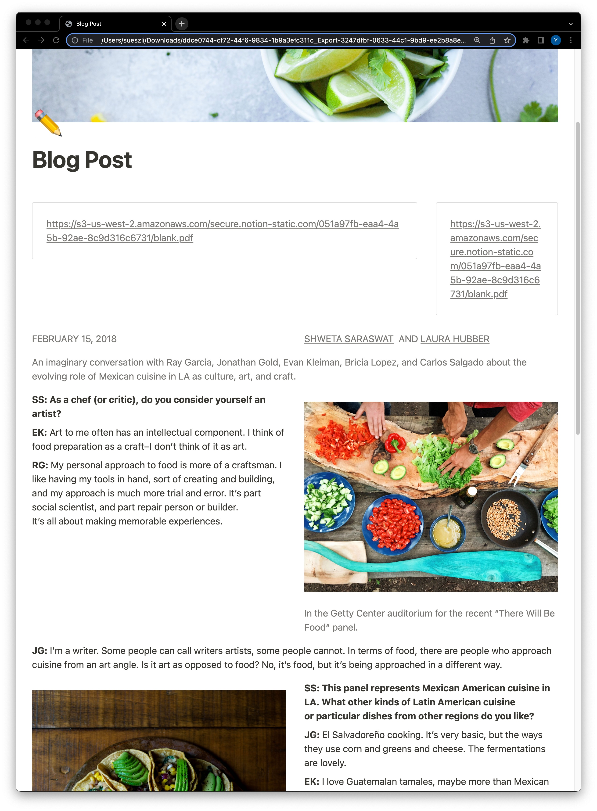
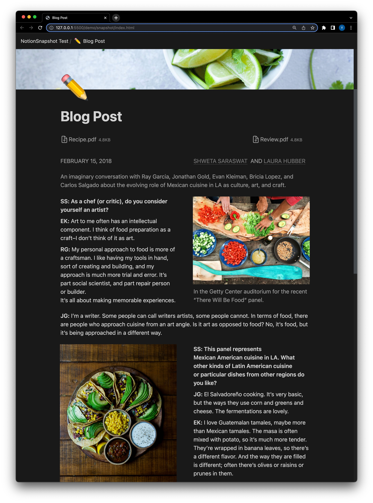
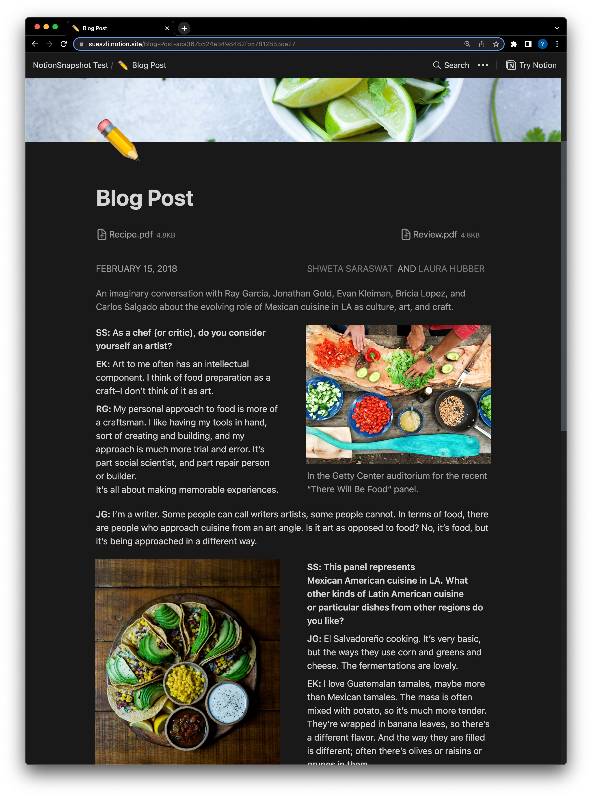

```
    _   __      __  _                _____                        __          __ 
   / | / /___  / /_(_)___  ____     / ___/____  ____ _____  _____/ /_  ____  / /_
  /  |/ / __ \/ __/ / __ \/ __ \    \__ \/ __ \/ __ `/ __ \/ ___/ __ \/ __ \/ __/
 / /|  / /_/ / /_/ / /_/ / / / /   ___/ / / / / /_/ / /_/ (__  ) / / / /_/ / /_  
/_/ |_/\____/\__/_/\____/_/ /_/   /____/_/ /_/\__,_/ .___/____/_/ /_/\____/\__/  
                                                    /_/     

The HTML export tool for Notion that actually works!

```

  |   |  
:-------------------------:|:-------------------------:|:-------------------------:
Default export              |  **✨NotionSnapshot✨**  | Original page 

<br>

If you have ever used the default HTML export feature in Notion, you already know that the exported files are not very useful. They are not styled the same way as the original page and even miss some content.

Our snapshots not only look almost identical to the original page, but it also strip out all the unnecessary bloat, like Notion's analytics, vendors scripts, vendors styles, and javascript left in to enable collaboration – this significantly reduces the page size and load time.

With this tool you now can:

- free yourself from the Notion lock-in
- use Notion as your content management system
- share your content with custom domain names instead of notion.site URLs

<br><br><br><br>

# Installation

First you must set the page that you want to export to be publicly accessible:

1. Open the page you want to export to HTML in Notion
2. Click on the `Share` button in the top right corner
3. Toggle the `Share to web button` (if not already enabled)
4. Copy the link to the page by clicking on the `Copy link` button

Make sure to store the link you just copied somewhere safe, you will need it later.

<br>

#### 1. Installing Python

If you are on a Windows machine, you first need to install [WSL (Windows Subsystem for Linux)](https://learn.microsoft.com/en-us/windows/wsl/install).

Either way, you need to have the following dependencies:

- [Python 3](https://www.python.org/downloads/)
- [Pip](https://pip.pypa.io/en/stable/installation/)
- [Poetry](https://python-poetry.org/docs/#installing-with-the-official-installer)
- [Chrome](https://www.google.com/chrome/)

Installing Chrome on WSL/Ubuntu can be a little bit tricky, but here is what worked for me:

```bash
sudo apt update && sudo apt upgrade -y
wget https://dl.google.com/linux/direct/google-chrome-stable_current_amd64.deb
sudo dpkg -i google-chrome-stable_current_amd64.deb
sudo apt --fix-broken install
rm -rf google-chrome-stable_current_amd64.deb
```

<br>

#### 2. Cloning the repository

```bash
git clone https://github.com/sueszli/notionSnapshot.git
cd notionSnapshot      
```

<br>

#### 3. Installing dependencies

```bash
poetry install --sync
```

But be careful because some dependencies might still be missing after this step. You then might have to install them again with pip manually (e.g. `pip install <missing dependency>`).

<br>

#### 4. Running the application

Use the `-h` or `--help` flag when running the script to see all the options that are available:

```bash
python3 notionsnapshot --help      
```

You can for instance scrape the pages in dark mode by using the `--dark-mode` option or display the browser while scraping by using the `--show-browser` option.

Once you've made up your mind, you can run the script with the URL of the Notion page you want to scrape:

```bash
python3 notionsnapshot <notion page url>      
```

Alternatively you can run some of our test pages which are listed in the `test.sh` file.

<br><br><br><br>

---

Special thanks to:

- Leonardo Cavaletti who laid the foundation of this project with his lovely loconotion project
- [MJDeligan](https://github.com/MJDeligan) the main contributor, who resolved the hardest issues and added the most important features

aswell as Stefan Brandmair, Thomas Biedermann and Berndt Uhlig who helped me with the initial setup of this project.
